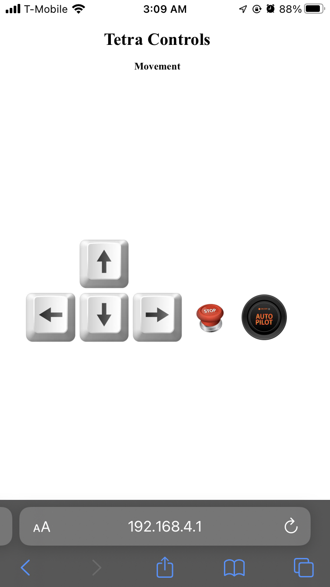
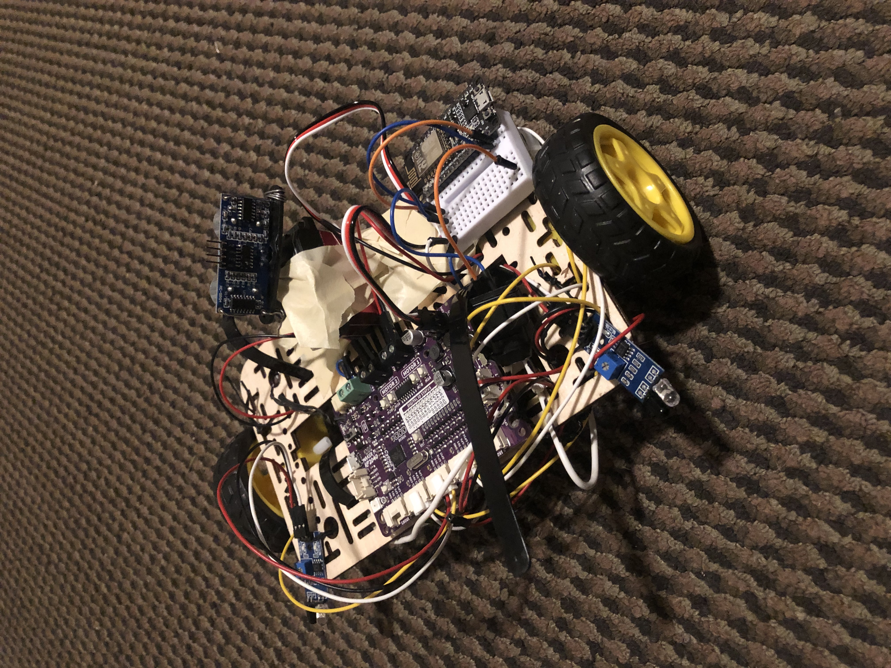

# Web Server Rover

   A rover controlled by a local web server with an autonomous sentry mode.

## Description

  This rover was inspired by a webots line sensing tutorial.

### Dependencies

* ESP8266WiFi
* ESPAsyncWebServer
* LittleFS

### Hardware

* NodeMcu ESP12 dev board
* Cytron Maker Pi RP20240
* 2 dc motors
* 2 IR proximity sensors
* 3 AA batteries
* Frame and wheels 

### Executing program

* Navigate to Ip address of ESP local webserver.
* Local web server communicates with Cytron Maker Pi to provide instructions for motor control. In sentry mode robot controller also processes sensor data to avoid obstacles.
  

  
  

  
## Author

Samuel Kalu
  
* email : [samkalu@ttu.edu](mailto:samkalu@ttu.edu)
* linkedin : [@SamuelKalu](https://www.linkedin.com/in/samuel-kalu-74a359342/)

## Acknowledgments

Inspiration, code snippets, etc.
* [Webots](https://cyberbotics.com/doc/guide/tutorial-4-more-about-controllers?tab-language=c++)
