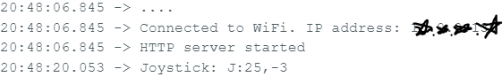

# Web Server Rover

   A gamepad client for the teleoperation of the UGV rover.

## Description

### Hardware

* Logitech Extreme 3D Pro 
* Waveshare Rover kit
* Laptop

  
### Dependencies 

#### Xiao
* ArduinoJson

### Executing program

* Modify TetraWebSrv.ino with your wifi credentials and upload it to the Xiao then navigate to Ip address of ESP local webserver printed in the serial console. \
  
  
## Author

Samuel Kalu
  
* email : [samkalu@ttu.edu](mailto:samkalu@ttu.edu)
* linkedin : [@SamuelKalu](https://www.linkedin.com/in/samuel-kalu-74a359342/)

## Acknowledgments

Inspiration, code snippets, etc.
* [Webots](https://cyberbotics.com/doc/guide/tutorial-4-more-about-controllers?tab-language=c++)
