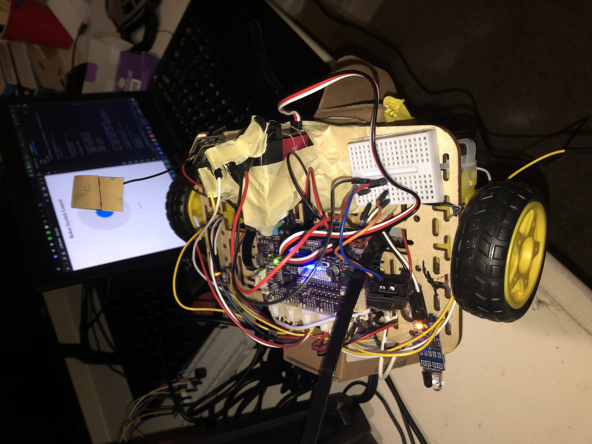

# Web Server Rover

   A rover controlled by a local web server.

## Description

Web Server rover that replaces the esp12 with esp32 leveraging UART to communicate with Cytron Maker Pi robot controller. 

### Hardware

* Xiao Esp32S3 Sense
* Cytron Maker Pi RP20240
* 2 dc motors and wheels
* 2 IR proximity sensors
* 3 AA batteries
* Wooden Frame

  
### Dependencies

#### Xiao
* ArduinoJson
#### Maker Pi
* hardware/uart

### Executing program

* Navigate to Ip address of ESP local webserver.
* Local web server listens and communicates gamepad or mouse events to the Cytron Maker Pi, providing more precise control of the rover's motor system. 
  

  
   
  

  
## Author

Samuel Kalu
  
* email : [samkalu@ttu.edu](mailto:samkalu@ttu.edu)
* linkedin : [@SamuelKalu](https://www.linkedin.com/in/samuel-kalu-74a359342/)

## Acknowledgments

Inspiration, code snippets, etc.
* [Webots](https://cyberbotics.com/doc/guide/tutorial-4-more-about-controllers?tab-language=c++)
