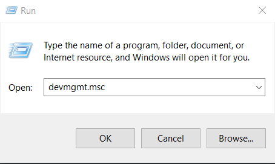

# Web Server Rover

   A gamepad client for the teleoperation of the UGV rover.

## Description

### Hardware

* Logitech Extreme 3D Pro 
* Waveshare Rover kit
* Laptop


### Executing program

* Clone the repo
```
git clone https://github.com/SamKa1u/Web-Server-Rover.git
```

#### Ensure your gampead is connected to your laptop by doing the following:
1.  Press the Windows key + R, type devmgmt.msc in the Run box   

2. Verify your gamepad is visible from device manager, you can find it under Human Interface Devices
  
3. Double click UGVstick.html and open in a web browser
  

## Author


Samuel Kalu
  
* email : [samkalu@ttu.edu](mailto:samkalu@ttu.edu)
* linkedin : [@SamuelKalu](https://www.linkedin.com/in/samuel-kalu-74a359342/)


## Inspiration, code snippets, etc.
#### Waveshare
* [Wiki](https://www.waveshare.com/wiki/General_Driver_for_Robots)
