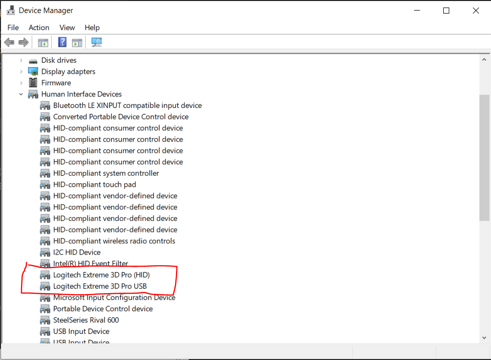
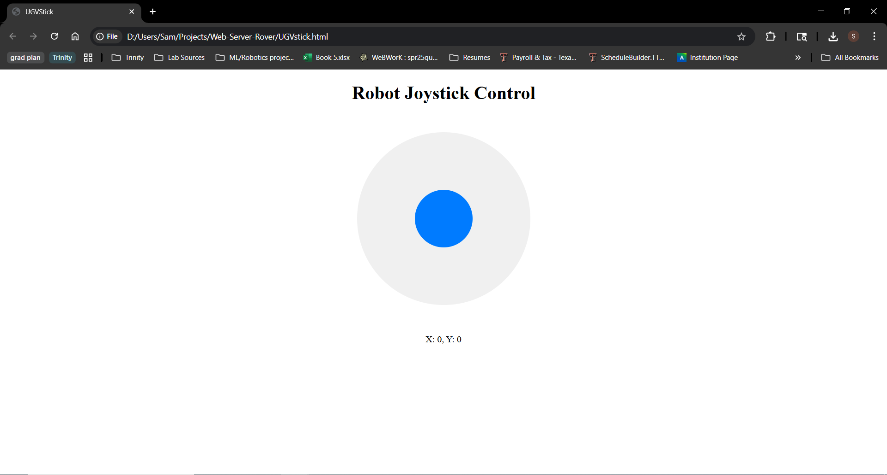

# Web Server Rover

   A gamepad client for the teleoperation of the UGV rover.

## Description

### Hardware

* Logitech Extreme 3D Pro 
* Waveshare Rover kit
* Laptop/PC running Windows


### Executing program

#### Clone the repo from cmd line in a project directory of your choosing
```
git clone https://github.com/SamKa1u/Web-Server-Rover.git
```

#### Ensure your gamepad is connected to your windows device by doing the following:
1.  Press the Windows key + R, type devmgmt.msc in the Run box   

2. Verify your gamepad is visible from device manager, you can find it under Human Interface Devices
  
3. Double click UGVstick.html and open in a web browser, you should see the onscreen joystick respond to your gamepad's axis_0 and axis_1 inputs (typically the left stick)
  
4. You can vist [this](https://hardwaretester.com/gamepad) hardware tester if you are still haveing issues

####  Connect to the UGV AP from your device
  

#### Get the IP address of your wave rover and modify the path variable of the sendJoystickData function in handleGamepad.js to reach it

```
function sendJoystickData(x, y) {
        const req = new XMLHttpRequest();
----->  const path = "http://192.168.4.1/js?json=";  <------
        req.addEventListener("load", reqListener);
        // let l=0,r=0;
        switch (true) {
```
####  Once the rover receives the requests it will respond to the gamepads input  


## Author


Samuel Kalu
  
* email : [samkalu@ttu.edu](mailto:samkalu@ttu.edu)
* linkedin : [@SamuelKalu](https://www.linkedin.com/in/samuel-kalu-74a359342/)


## Inspiration, code snippets, etc.
#### Waveshare
* [Wiki](https://www.waveshare.com/wiki/General_Driver_for_Robots)
